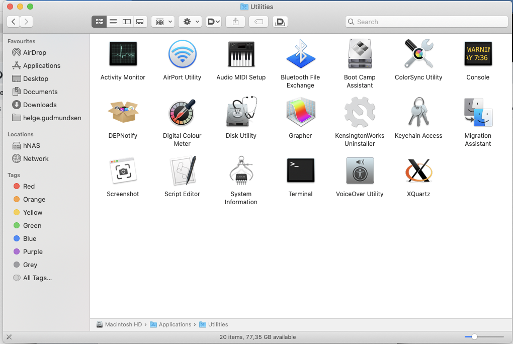
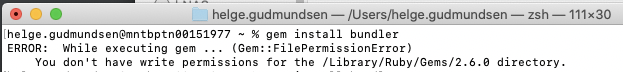
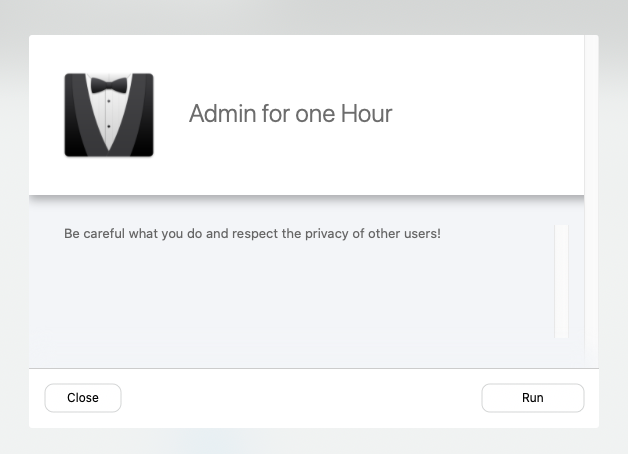

# Detailed information for installation

Note, these instructions are for the Mac, as I don't have a Windows machine to run this on.

The first thing to check is if we have a Ruby installation we can use. For this we need to use the `Terminal` application which you can find in the Utilities folder inside tha Applications folder (available in the Favourites section of the sidebar in the Finder)

To check if we can use the built-in ruby version that comes with macOS, try to write the following command in the Terminal window:

`gem install bundler`

If this works, we are good to go, and can [continue with installing the script](#installing-the-script).

On my machine, I am not allowed to do this, as I get the following error message:

In order to get around this issue (and because I also like to control which version of ruby I run), I install a set of 
tools on the mac. The details are described in the next section.

## Installing homebrew, rbenv and ruby

### Install Homebrew

[Homebrew](https://brew.sh/) is a package manager for the Mac which makes it easy to install stuff you need. We will use 
homebrew to install a tool that makes it easy to control ruby versions on our computer. Ruby is the scripting language 
that I used to wrote the idontime-bot.

To install homebrew, you might need to have administrator rights on the computer. In the MAN Digital Hub, we gan 
request admin rights from the self service portal, selecting the "Admin for one hour" option:

I don't know if something similar exists for the other Tech Units, as our machines are managed by MAN Truck & Bus. 
I would appreciate if colleagues from the other tech units could update this document with specific information that 
applies to them.

To install homebrew, it is sufficient to run a command in the terminal window. The details are on the homebrew homepage,
but basically the command is:

`/bin/bash -c "$(curl -fsSL https://raw.githubusercontent.com/Homebrew/install/HEAD/install.sh)"`

### Install rbenv

Once homebrew has been installed, we can install [rbenv](https://github.com/rbenv/rbenv).

Since we now have homebrew on the computer, installation is very easy. Just type the following command in the Terminal:

`brew install rbenv`

### Install ruby

With rbenv installed, installing a ruby version is just as easy. In the terminal, write the following command

`rbenv install 2.7.2`

This will install ruby version 2.7.2, which is what I used for writing the script.

To initialise the `rbenv` tool, run the following command:

`rbenv init`

To handle dependencies (tools that our script needs), we use a tool called `bundler`. This is installed by running the
following command in the terminal.

## Installing the script

Now that we have a working ruby installation we can clone the idontime script from github to run it on our machine.

First, in the Terminal create a new folder where we keep our scripts by entering the following command:

`mkdir scripts`

Then move into this folder:

`cd scripts`

Now it is time to copy the script from github to our machine:

`git clone https://github.com/HelgeG/idontime-bot.git`

Now we can prepare the dependencies that are require by running the following commands:

`cd idontime-bot`  
`bundle init`  

Our environment should now be ready to run the script.

## Running the script

Move to the directory where the idontime script is located:

`cd ~/scripts/idontime-bot`

Execute the script by typing the following:

`./idontime --user yourusername@domain.com --password yourpassword`

This will insert entries for today, with arrival at 9am and exit at 6pm.

All the possible arguments and commands are listed on the [README](README.md) page.
